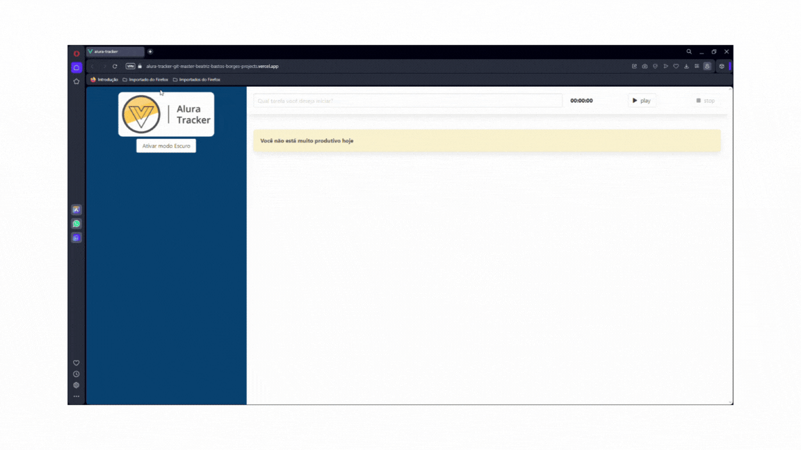

# alura-tracker

<p align="center"></p>

## About

Uma aplicação feita para você manter anotar as atividades que você desenvolve durante seu dia, além de descobrir o tempo que você levou para realizala.

> [!NOTE]
> Click [here](https://alura-tracker-git-master-beatriz-bastos-borges-projects.vercel.app) to check to test.

## Project setup
```
npm install
```

### Compiles and hot-reloads for development
```
npm run serve
```

### Compiles and minifies for production
```
npm run build
```

### Lints and fixes files
```
npm run lint
```

### Customize configuration
See [Configuration Reference](https://cli.vuejs.org/config/).
